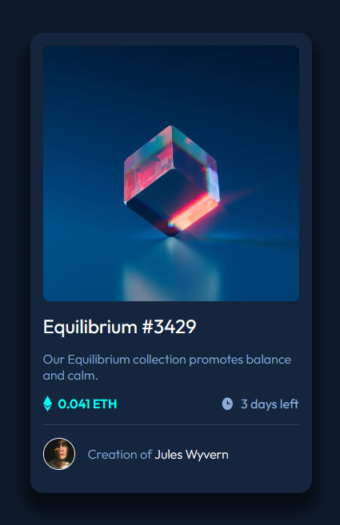

# Frontend Mentor - NFT preview card component solution

This is a solution to the [NFT preview card component challenge on Frontend Mentor](https://www.frontendmentor.io/challenges/nft-preview-card-component-SbdUL_w0U). Frontend Mentor challenges help you improve your coding skills by building realistic projects. 

## Table of contents

- [Overview](#overview)
  - [The challenge](#the-challenge)
  - [Screenshot](#screenshot)
  - [Links](#links)
- [My process](#my-process)
  - [Built with](#built-with)
  - [What I learned](#what-i-learned)
  - [Useful resources](#useful-resources)
- [Author](#author)

## Overview

To recreate the preview card shown here:

### The challenge

Users should be able to:

- View the optimal layout depending on their device's screen size
- See hover states for interactive elements

### Screenshot

My solution:

### Links

- Solution URL: [Frontend Mentor](https://www.frontendmentor.io/solutions/nft-preview-card-eiscDhQLGr)
- Live Site URL: [Github live site](https://tombirbeck.github.io/nft-preview-card/)

## My process

I began by setting the box-sizing to border-box and the padding and margin to 0. I then created the custom variables for the colours and imported the correct font and weights.\
I then planned out how what I would need to do to get the correct layout. I built up the HTML frame and added the styling needed for the base card state.\
Finally I added the active states where needed, including the overlay for the picture, and a box-shadow to make the card "pop".

### Built with

- Semantic HTML5 markup
- CSS custom properties
- Flexbox
- CSS Grid
- Mobile-first workflow

### What I learned

This challenge was good for learning about adding an overlay to images.

### Useful resources

- [w3docs](https://www.w3docs.com/snippets/css/how-to-overlay-images-with-css.html) - This helped me with adding the image overlay effect on hover.

## Author

- Website - [Tom Birbeck](https://portfolio-tombirbeck.vercel.app/)
- Frontend Mentor - [@TomBirbeck](https://www.frontendmentor.io/profile/TomBirbeck)

